## 🚢📊 MLOps Showcase — Titainic Survival Prediction Web App

**An end‑to‑end MLOps pipeline: ETL → data pipeline (ingestion, preprocessing, feature store integration, validation, versioning) → training & experiment tracking → API backend → model monitoring → Web UI → Testing → CI/CD → Cloud (GKE)**

<div align="center">

[](https://www.python.org/downloads/)
[](https://airflow.apache.org/)
[](https://redis.io/)
[](https://dvc.org/)
[](https://www.comet.com/)
[](https://fastapi.tiangolo.com/)
[](https://github.com/SeldonIO/alibi-detect)
[](https://prometheus.io/)
[](https://grafana.com/)
[](https://flask.palletsprojects.com/)
[](https://github.com/features/actions)
[](https://cloud.google.com/kubernetes-engine)

</div>

<br>

## 📚 0. Table of Contents
<details>
  <summary><strong>Expand to view contents</strong></summary>
<br>

- [🚢📊 MLOps Showcase — Titainic Survival Prediction Web App](#-mlops-showcase--titainic-survival-prediction-web-app)
- [📚 0. Table of Contents](#-0-table-of-contents)
- [🎯 1. Project Overview](#-1-project-overview)
- [🚀 2. Quick Start \& Services Usage](#-2-quick-start--services-usage)
  - [2.1 Quick Start (Using Pre‑built Artifacts and Monitoring Stack)](#21-quick-start-using-prebuilt-artifacts-and-monitoring-stack)
  - [2.2 Services Usage](#22-services-usage)
  - [2.3 Optional: Try the Cloud‑Hosted Version (If Available)](#23-optional-try-the-cloudhosted-version-if-available)
- [📁 3. Repository Structure](#-3-repository-structure)
- [🧩 4. Architecture](#-4-architecture)
  - [4.1 Project Structure (Modules \& System Flow)](#41-project-structure-modules--system-flow)
  - [4.2 Application Flow (Runtime Interaction)](#42-application-flow-runtime-interaction)
- [🔎 5. Logging](#-5-logging)
- [🔐 6. Service Accounts, Credentials \& Environment Variables](#-6-service-accounts-credentials--environment-variables)
  - [6.1 Service Accounts](#61-service-accounts)
  - [6.2 Credentials \& Environment Variables](#62-credentials--environment-variables)
- [🛠️ 7. Development](#️-7-development)
- [🧪 8. Testing](#-8-testing)
- [☁️ 9. Deployment](#️-9-deployment)
  - [9.1 Kubernetes Deployment Configuration](#91-kubernetes-deployment-configuration)
  - [9.2 Github Actions CI/CD Pipeline](#92-github-actions-cicd-pipeline)
  - [9.3 Accessing the Deployed Application](#93-accessing-the-deployed-application)
- [🔮 10. Opportunities for Enhancement](#-10-opportunities-for-enhancement)

</details>

<br>

## 🎯 1. Project Overview

The **Titanic Survival Prediction Web App** is a fully‑engineered, end‑to‑end MLOps showcase that demonstrates how a classic machine learning model can be transformed into a production‑ready, full‑stack pipeline.  
It embodies the philosophy of modern MLOps by combining robust data workflows, cloud‑native orchestration, and comprehensive observability into a single cohesive system.

The project illustrates the complete lifecycle of a real‑world ML application:  
from the **data pipeline** (covering ingestion, preprocessing, feature store integration, validation, and versioning), to the **training pipeline** (model training, evaluation, and experiment tracking), to **API‑based inference services** enhanced with **model monitoring** (metrics and dashboards), and ultimately to a **dedicated Web UI layer** for user interaction.  
This separation of concerns reflects a clean architectural principle, enabling independent delivery of backend and frontend components while maintaining scalability and clarity.

At the infrastructure level, the system leverages **Kubernetes multi‑container orchestration** in a cloud serverless setting, deployed on **GKE Autopilot**.  
This provides elasticity, resilience, and automated resource management, showcasing how containerized ML services can be operated at scale without manual cluster administration.

Beyond the core pipelines, the project further showcases practical operational concerns essential to modern MLOps:  
- **Logging** for transparent system behavior and debugging  
- **Testing** to ensure reliability and correctness across components  
- **Containerization** for reproducible environments and modular deployment  
- **Automated CI/CD** pipelines that deliver continuous integration and seamless deployment to GKE  

Operational excellence is reinforced through a rich ecosystem of tools:  
- **DVC** for reproducible data versioning  
- **Comet-ML** for experiment tracking, model versioning, and lifecycle management  
- **Alibi‑Detect** for drift detection and model integrity monitoring  
- **Prometheus + Grafana** for real‑time system metrics, visualization, and health dashboards  

Together, these integrations deliver **multi‑angle tracking and monitoring capabilities**, ensuring transparency across data, models, and infrastructure.

Overall, this repository is designed to highlight how a full‑stack MLOps pipeline can be built, deployed, and observed in a cloud‑native environment—emphasizing modularity, observability, and end‑to‑end engineering discipline.

### Why this matters for industry
This showcase directly addresses enterprise challenges in operationalizing machine learning: ensuring **data reproducibility**, **experiment traceability**, **automated CI/CD delivery**, and **production‑grade monitoring**. These capabilities are critical for scaling ML systems in industry, reducing risk, and accelerating the journey from research prototypes to reliable, cloud‑deployed services.

### Tech Stack

<div align="center">

| Component | Technology | Description |
|-----------|------------|-------------|
| 🪂 **ETL Pipeline** | Apache Airflow | Orchestrates initial extraction and loading of Titanic dataset from GCS to Postgres |
| 📦 **Data Versioning** | DVC | Ensures reproducible datasets and tracks data lineage |
| ☄️ **Experiment Tracking** | Comet-ML | Tracks experiments, manages model versioning, and lifecycle logging |
| 🟥 **Feature Store** | Redis | Provides fast access to engineered features for training and inference |
| ⚡ **API Backend** | FastAPI | Serves trained models through RESTful inference endpoints |
| 🔍 **Model Integrity** | Alibi‑Detect | Detects drift and monitors model behavior for reliability |
| 📈 **Metrics Monitoring** | Prometheus | Collects real‑time system and model metrics |
| 📊 **Visualization** | Grafana | Displays dashboards for observability and system health |
| 🖥️ **Frontend Web Layer** | Flask + Web UI | Delivers user interface, decoupled from backend APIs |
| 🐳 **Containerization** | Docker | Packages services into reproducible, portable containers |
| 🔄 **CI/CD** | GitHub Actions | Automates testing, building, and deployment workflows |
| ☁️ **Cloud Orchestration** | GKE Autopilot | Provides serverless Kubernetes multi‑container deployment and scaling |

</div>

<br>

## 🚀 2. Quick Start & Services Usage

### 2.1 Quick Start (Using Pre‑built Artifacts and Monitoring Stack)

The fastest way to run the application is to use the **pre‑built artifacts and monitoring configuration** included in this repository.  
This allows you to launch the full MLOps stack immediately without re‑running ETL or model training.

#### **Step 1 — Clone the repository**

```bash
git clone https://github.com/your-username/mlops-e2e-k8s.git
cd mlops-e2e-k8s
```

The repository already includes:

- `artifacts/` — processed datasets and trained models required by the FastAPI service  
- `fastapi_api/`, `flask_ui/`, `src/` — source code and Docker build resources  
- `docker-compose.yml` — multi‑container orchestration (FastAPI, Flask, Prometheus, Grafana)  
- `.env.example` — environment variable template  
- `prometheus.yml` + `provisioning/` — monitoring configuration for Prometheus and Grafana  
- `prometheus-data/` — pre‑built Prometheus persistent data  

#### **Step 2 — Prepare environment variables**

Copy the example environment file:

```bash
cp .env.example .env
```

Update the following variable:

```
COMETML_API_KEY=<your_cometml_api_key>
```

No database connection updates are required at this stage.

#### **Step 3 — Build Docker images**

```bash
docker compose build
```

This builds:

- **FastAPI service** — model inference API  
- **Flask service** — web UI frontend  
- **Prometheus service** — metrics collection  
- **Grafana service** — dashboard visualization  

#### **Step 4 — Start the application**

```bash
docker compose up
```

Once the containers start, the services will be available at:

- Flask UI Service → [http://localhost:5000](http://localhost:5000)  
- FastAPI API Service → [http://localhost:8000](http://localhost:8000)  
- Prometheus Metrics Service → [http://localhost:9090](http://localhost:9090)  
- Grafana Dashboard Service → [http://localhost:3000](http://localhost:3000)  

#### **Step 5 — Verify functionality**

- Open the **Flask Web UI** and test model inference by entering valid feature values and clicking **Predict**  
- Visit the **FastAPI Swagger UI** at `http://localhost:8000/docs` to explore API endpoints  
- Check **Prometheus metrics** at `http://localhost:8000/metrics` to confirm FastAPI metrics are being scraped  
- Log in to **Grafana** at `http://localhost:3000/d/ad4qm7g/mlops-model-monitoring-dashboard-titanic-example` and verify dashboards display metrics  

👉 For detailed service usage instructions, continue to **Section 2.2 — Services Usage**.

---

### 2.2 Services Usage

Once the application is running, you can interact with the four core services — **Flask UI Service**, **FastAPI API Service**, **Prometheus Metrics Service**, and **Grafana Dashboard Service** — each serving a distinct role in the MLOps stack.

#### **Flask UI Service**

- **Endpoint**: `http://localhost:5000`  
- **How to use**:  
  - Enter valid feature values in the form (e.g., Titanic passenger gender, age, fare).  
  - Click the **Predict** button to receive the model inference result (*Survived* or *Did Not Survive*).  
- **Purpose**: Provides a user-friendly web interface to quickly experience model inference.

<div align="center">
  
  <p><em>Flask UI — Successful prediction result</em></p>
</div>

#### **FastAPI API Service**

- **Endpoint**: `http://localhost:8000`  
- **How to use**:  
  - Visit Swagger UI (`/docs`) to test API endpoints.  
  - Key endpoints:  
    - `POST /predict` → Submit JSON payload for inference.  
    - `GET /metrics` → Exposes Prometheus-formatted monitoring metrics.  
    - `GET /health` → Health check.  
    - `GET /` → Root path, returns a welcome message.  
- **Purpose**: Provides programmatic APIs for inference, monitoring, and health checks.

<div align="center">
  
  <p><em>FastAPI Swagger UI — API testing interface</em></p>
</div>

#### **Prometheus Metrics Service**

- **Endpoint**: `http://localhost:9090` (primarily for health checks; actual monitoring metrics come from FastAPI `/metrics`)  
- **How to use**:  
  - Prometheus scrapes FastAPI metrics according to `prometheus.yml` configuration.  
  - You can directly visit FastAPI `/metrics` (`http://localhost:8000/metrics`) to confirm metrics exposure.  
- **Key metrics**:  
  - `prediction_request_total` → Total number of prediction requests  
  - `drift_total` → Number of detected data drift events  
  - `prediction_latency_seconds_bucket` → Distribution of prediction latency  
  - `prediction_error_total` → Number of failed predictions  
- **Purpose**: Collects and stores health and performance metrics of the model service.

<div align="center">
  
  <p><em>Prometheus — Successfully scraping FastAPI metrics</em></p>
</div>

#### **Grafana Dashboard Service**

- **Endpoint**: `http://localhost:3000`  
- **Dashboard URL**: `http://localhost:3000/d/ad4qm7g/mlops-model-monitoring-dashboard-titanic-example`  
- **How to use**:  
  - Log in to Grafana and open the pre-configured **MLOps Model Monitoring Dashboard (Titanic Example)**.  
  - Dashboard panels include:  
    - **Requests / time** → Time series of prediction requests.  
    - **Drift Events / time** → Time series of data drift events.  
    - **Prediction Latency Seconds** → Distribution of prediction latency (bargauge).  
    - **Success vs Error** → Ratio of successful vs failed predictions (pie chart).  
- **Purpose**: Provides visual monitoring to track model performance, latency, drift, and error rates.

<div align="center">
  
  <p><em>Grafana — Model monitoring dashboard</em></p>
</div>

---

### 2.3 Optional: Try the Cloud‑Hosted Version (If Available)

A GKE‑hosted version of this application has been deployed as part of the CI/CD pipeline.  
If the services are currently active, you can access the live endpoints here:

- **Flask UI Service** → [http://35.227.15.177:5000/](http://35.227.15.177:5000/)  
- **FastAPI API Service (Swagger UI)** → [http://35.231.166.61:8000/docs](http://35.231.166.61:8000/docs)  
- **FastAPI API Service (Prometheus Metrics)** → [http://35.231.166.61:8000/metrics](http://35.231.166.61:8000/metrics)  
- **Grafana Dashboard Service** → [http://34.73.73.108:3000/d/ad4qm7g/mlops-model-monitoring-dashboard-titanic-example](http://34.73.73.108:3000/d/ad4qm7g/mlops-model-monitoring-dashboard-titanic-example)  

Note that the Prometheus Metrics Service is not exposed externally, since it is designed for internal scraping only. FastAPI provides the /metrics endpoint so Prometheus can collect model‑level metrics, while Grafana offers the external visualization layer for users.

These endpoints allow you to experience the fully deployed version without running Docker locally.

> **Note:**  
> These URLs may change or become unavailable in the future depending on cloud resource limits and account lifecycle.  
> If the links are inactive, please run the application locally using the steps in **2.1 Quick Start**.

<br>

## 📁 3. Repository Structure
<details>
  <summary><strong>Click to expand repository tree</strong></summary>

```
mlops-e2e-k8s/
├── .astro/                               # Astro configuration (auto-generated by `astro dev init`, further modified)
│   └── config.yaml
├── .dvc/                                 # DVC internal metadata for data versioning (auto-generated by `dvc init`, further modified)
├── .github/workflows/                    # GitHub Actions CI/CD configuration
│   └── deploy.yml
├── artifacts/                            # Centralized storage of datasets, models, and pipeline outputs
│   ├── models/                           # Serialized preprocessing artifact and ML model
│   │   ├── preprocessor.joblib           # Preprocessing pipeline object
│   │   └── random_forest_model.joblib    # Trained Random Forest model
│   ├── processed/                        # Processed dataset ready for training, and its DVC tracking file
│   │   ├── processed.csv
│   │   └── processed.csv.dvc
│   ├── raw/                              # Raw dataset before transformation, and its DVC tracking file
│   │   ├── titanic.csv
│   │   └── titanic.csv.dvc
│   ├── split/                            # Train/test split datasets
│   │   ├── test.csv
│   │   └── train.csv
│   ├── .dockerignore                     # Ignore rules for Docker builds in artifacts context
│   └── data_validation_report.json       # Report generated by data validation step
├── dags/                                 # Airflow DAGs for ETL and orchestration
│   └── extract_data_from_gcp.py          # DAG to extract Titanic dataset from GCS and load into Postgres
├── fastapi_api/                          # FastAPI service for model inference
│   ├── .dockerignore                     # Ignore rules for Docker builds in fastapi_api context
│   ├── Dockerfile                        # Dockerfile for FastAPI service
│   ├── __init__.py
│   ├── api.py                            # FastAPI application entrypoint
│   └── requirements.txt                  # Dependencies for FastAPI service
├── flask_ui/                             # Flask-based Web UI layer
│   ├── static/                           # Static assets (CSS, JS)
│   │   ├── script.js
│   │   └── style.css
│   ├── templates/                        # HTML templates for UI rendering
│   │   └── index.html
│   ├── .dockerignore                     # Ignore rules for Docker builds in flask_ui context
│   ├── Dockerfile                        # Dockerfile for Flask UI service
│   ├── __init__.py
│   ├── requirements.txt                  # Dependencies for Flask UI
│   └── ui.py                             # Flask app entrypoint serving the Web UI
├── notebook/                             # Jupyter notebooks for exploration and prototyping
│   └── titanic.ipynb
├── prometheus-data/                      # Prometheus persistent data storage (pre-built for Quick Start)
├── provisioning/                         # Grafana provisioning configs
│   ├── dashboards/                       # Predefined Grafana dashboards
│   │   ├── dashboards.yml
│   │   └── my-dashboard.json
│   └── datasources/                      # Grafana datasource configurations
│       └── datasources.yml
├── screenshots/                          # Screenshot images used in README.md
├── src/                                  # Core ML pipeline source code
│   ├── components/                       # Modular components (feature store, preprocessing, schema)
│   │   ├── __init__.py
│   │   ├── feature_store.py              # Redis feature store integration
│   │   ├── preprocessor.py               # Preprocessing logic
│   │   └── schema.py                     # Data schema definitions
│   ├── pipeline/                         # End-to-end pipeline modules
│   │   ├── __init__.py
│   │   ├── data_ingestion.py             # Data ingestion routines
│   │   ├── data_processing.py            # Data preprocessing and feature store integration
│   │   ├── data_to_train_pipeline.py     # Orchestration from data to training
│   │   ├── data_validation.py            # Validation checks and reporting
│   │   └── model_training.py             # Model training, evaluation, and experiment tracking
│   ├── .dockerignore
│   ├── __init__.py
│   ├── config.py                         # Centralized configuration
│   ├── exception.py                      # Custom exception handling
│   ├── logger.py                         # Logging utilities
│   └── utils.py                          # Helper functions
├── tests/                                # Unit tests for DAGs, API, and UI
│   ├── test_dags.py                      # Tests for Airflow DAGs
│   ├── test_fastapi.py                   # Tests for FastAPI API
│   └── test_flask.py                     # Tests for Flask UI
├── .dockerignore                         # Ignore rules for Airflow Docker build (auto-generated by `astro dev init`)
├── .dvcignore                            # Ignore rules for DVC (auto-generated by `dvc init`)
├── .env.example                          # Environment variable template for local development
├── .gitignore                            # Git ignore rules for the repository
├── Dockerfile                            # Root-level Airflow Dockerfile (auto-generated by `astro dev init`)
├── README.md                             # Project documentation
├── all-services.yml                      # Kubernetes manifest for deploying all services
├── docker-compose.yml                    # Local multi-container orchestration for development
├── monitoring-pvc.yml                    # Kubernetes PersistentVolumeClaim for Prometheus/Grafana data
├── packages.txt                          # Astro-specific system packages (apt dependencies for Airflow container build)
├── prometheus.yml                        # Prometheus configuration file
├── pyproject.toml                        # Tooling configuration (Ruff, Pytest, Coverage)
├── requirements-dev.txt                  # Full development dependencies
├── requirements-test.txt                 # Testing dependencies (especially for lint and test jobs)
├── requirements.txt                      # Astro Airflow dependencies (used by `astro dev start`)
└── setup.py                              # Python package setup script
```
</details>

<br>

## 🧩 4. Architecture

### 4.1 Project Structure (Modules & System Flow)

The diagram below illustrates the end‑to‑end pipeline — from ETL to cloud deployment — together with the concrete Python modules and configs that implement each stage.

```mermaid
flowchart LR
    %% ============================
    %% High-level pipeline (main flow)
    %% ============================
    ETL_PIPELINE[ETL Pipeline<br/>Airflow DAG]
        --> DATA_PIPELINE[Data Pipeline<br/>Ingestion → Preprocessing → Feature Store<br/>Validation → DVC]
        --> TRAINING[Training & Experiment Tracking<br/>Model Training + Comet-ML]
        --> API_BACKEND[API Backend<br/>FastAPI Inference Service + Alibi‑Detect]
        --> MONITORING[Model Monitoring<br/>Prometheus Metrics + Grafana Dashboard]
        --> WEB_UI[Web UI<br/>Flask Frontend]
        --> TESTING[Testing<br/>ruff + pytest]
        --> CICD[CI/CD & Deployment<br/>GitHub Actions → GKE]

    %% ============================
    %% Module-level mapping
    %% ============================
    subgraph ETL_Pipeline
        ETL[extract_data_from_gcp.py]
    end

    subgraph Data_Pipeline
        ING[data_ingestion.py]
        PRO[data_processing.py]
        VAL[data_validation.py]
        FS[feature_store.py]
        PRE[preprocessor.py]
        SCHEMA[schema.py]
        FS --> PRO
        PRE --> PRO
        FS --> VAL
        PRE --> VAL
        SCHEMA --> VAL
    end

    subgraph Training_Pipeline
        TRAIN[model_training.py]
        DATA_TO_TRAIN[data_to_train_pipeline.py]
        FS --> TRAIN
        ING --> DATA_TO_TRAIN
        PRO --> DATA_TO_TRAIN
        TRAIN --> DATA_TO_TRAIN
    end

    subgraph API_Backend
        API[api.py]
        PRE --> API
        SCHEMA --> API
    end

    subgraph Monitoring_Layer
        PROM_CONFIG[prometheus.yml]
        PROM_DATA[prometheus-data]
        PROV[provisioning/]
    end

    subgraph Web_UI
        FLASK_UI[ui.py]
    end

    subgraph Infra_Layer
        DOCKER[Dockerfiles]
        DEPLOY[deploy.yml]
        PVC[monitoring-pvc.yml]
        K8S[all-services.yml]
        DOCKER --> DEPLOY
        PVC --> DEPLOY
        K8S --> DEPLOY
    end

    subgraph Testing_Layer
      TEST_DAGS[test_dags.py]
      TEST_FASTAPI[test_fastapi.py]
      TEST_FLASK[test_flask.py]
      TEST_CONFIG[pyproject.toml]
      ETL --> TEST_DAGS
      API --> TEST_FASTAPI
      FLASK_UI --> TEST_FLASK
    end

    subgraph Shared_Utilities
        CONF[config.py]
        EXC[exception.py]
        LOG[logger.py]
        UTIL[utils.py]
    end

    %% Connect layers to high-level pipeline
    ETL_PIPELINE -. maps to .-> ETL
    DATA_PIPELINE -. maps to .-> ING
    TRAINING -. maps to .-> TRAIN
    API_BACKEND -. maps to .-> API
    MONITORING -. maps to .-> PROM_CONFIG
    WEB_UI -. maps to .-> FLASK_UI
    TESTING -. maps to .-> TEST_DAGS
    CICD -. maps to .-> K8S
```



### Key idea  
A two‑layer view:  
- **Top layer** shows the conceptual pipeline:  
```
ETL → Data Pipeline → Training & Experiment Tracking → API Backend → Model Monitoring → Web UI → Testing → CI/CD → Cloud (GKE)
```
- **Bottom layer** maps each stage to the actual Python modules and configs in this repository:  
```
ETL: extract_data_from_gcp.py
Data Pipeline: data_ingestion.py → data_processing.py + data_validation.py (consumes preprocessor + schema + feature_store; integrates DVC for data versioning)
Training: model_training.py → data_to_train_pipeline.py (consumes ingestion + processing + training; integrates Comet-ML for experiment tracking)
API Backend: api.py (consumes preprocessor + schema + trained model; integrates Alibi‑Detect for drift detection)
Monitoring: prometheus.yml + prometheus-data + provisioning/ (Grafana dashboards and datasources config)
Web UI: ui.py (Flask frontend consuming FastAPI API)
Testing: pyproject.toml → test_dags.py + test_fastapi.py + test_flask.py
CI/CD: Dockerfiles + all-services.yml + monitoring-pvc.yml → deploy.yml 
Utilities (shared across layers): config.py, exception.py, logger.py, utils.py
```

This representation keeps the architecture intuitive while explicitly tying each conceptual stage to its concrete implementation in the repo. It highlights the modular design and the end‑to‑end system flow from raw data to deployed cloud services.

---

### 4.2 Application Flow (Runtime Interaction)

The following diagram shows how a user request flows through the system at runtime, with an emphasis on the interaction between the **Flask UI**, **FastAPI API**, preprocessing, drift detection (via **Alibi‑Detect**), and monitoring.

<details>
  <summary><strong>Click to expand application flow diagram</strong></summary>


</details>

### Key idea  
The runtime flow spans the Flask UI and FastAPI services, while incorporating schema validation, preprocessing, drift detection, and monitoring.:  
- **Flask UI** receives user input and forwards it to FastAPI.  
- **FastAPI API** validates input, applies preprocessing, performs **drift detection using Alibi‑Detect (KSDrift)**, and generates predictions.  
- **Prometheus metrics** are updated during each request (requests, drift, latency, errors).  
- **Grafana dashboards** visualize these metrics for monitoring.  
- The **prediction result** is returned to the Flask UI and displayed to the user.

<br>

## 🔎 5. Logging  

This project uses a **standard Python logging utility** (`logger.py`) to provide consistent, timestamped logs across all components. This implementation emphasizes **structured output**, **file persistence**, and **streaming to stdout**, making it suitable for production‑grade MLOps pipelines.

### Design & Configuration  
- **Centralized setup**: `get_logger(name)` configures a logger with both a file handler and a console handler.  
- **Log format**:  
  ```
  %(asctime)s - %(levelname)s - %(name)s - %(message)s
  ```
  Each entry includes timestamp, severity level, module name, and message.  
- **Persistence**: Logs are written to daily rotating files under `logs/`, e.g. `log_2026-01-05.log`.  
- **Streaming**: Simultaneously printed to stdout for immediate feedback during development or containerized runs.

### Log Levels in Use  
| Level | Typical Examples | Purpose |
|-------|------------------|---------|
| **INFO** | Pipeline starts, DB connections, preprocessing steps, training metrics, model saved | Routine operational flow and progress tracking |
| **WARNING** | Network retries from `urllib3`, framework notices from Werkzeug | Non‑critical alerts, usually from external libraries |
| **ERROR** | File I/O failures, schema mismatches, preprocessing errors, invalid API calls | Critical issues where execution cannot proceed |

Overall, the logging setup is lightweight yet reliable, capturing routine operations, external warnings, and critical errors in a consistent format.

<br>

## 🔐 6. Service Accounts, Credentials & Environment Variables

### 6.1 Service Accounts  

#### 1. Custom Service Account  
- **Actual name in this project**: `mlops-repo1@mlops-repo1.iam.gserviceaccount.com`  
- **General format**: `{service_account_name}@{project_id}.iam.gserviceaccount.com`  
- **Purpose**: This account was manually created to support **local development workflows**, specifically for accessing a GCS bucket. It is used both by **Airflow DAGs** (ETL stage) and by **DVC** (data versioning). The file `include/service-account.json` was generated and downloaded from this account, and is used locally as the credential source. In CI/CD pipelines, the same account is referenced via the secret `GCP_SA_KEY`, ensuring credentials are injected securely at runtime.  
- **Permissions**: Roles assigned include Artifact Registry administration and Storage Object operations, ensuring full control over container image management and GCS object access.  

<div align="center">
  
  <p><em>Permissions configuration for the custom service account</em></p>
</div>  

#### 2. Default Compute Engine Service Account  
- **Actual name in this project**: `494661516250-compute@developer.gserviceaccount.com`  
- **General format**: `{project_number}-compute@developer.gserviceaccount.com`  
- **Purpose**: This account is automatically generated by GCP when Compute Engine or GKE is first enabled. In this project, it is used by **GKE node pools** to pull container images from Artifact Registry and to read objects from GCS buckets at runtime.  
- **Permissions**: Typically limited to Artifact Registry Reader and Storage Object Viewer, sufficient for cluster nodes to operate securely.  

<div align="center">
  
  <p><em>Permissions configuration for the default Compute Engine service account</em></p>
</div>  

By separating a **custom service account for ETL and CI/CD** from the **default account for GKE runtime**, the project maintains clarity of responsibilities and ensures both local reproducibility and secure cloud deployment.  

---

### 6.2 Credentials & Environment Variables  

Configuration in this project is split between **local development** and **CI/CD deployment**, with a clear separation to keep sensitive values secure and reproducible.  

#### Local Development  
- Environment variables are loaded from `.env` (see `.env.example`), covering database connection settings and the CometML API key.  
- The file `include/service-account.json`, created and downloaded from the custom service account (`mlops-repo1@mlops-repo1.iam.gserviceaccount.com`), is required for **Airflow DAGs** in the ETL stage **and for DVC remote operations**. It authenticates against Google Cloud Storage to fetch the Titanic raw CSV file and to push/pull datasets tracked by DVC.  
- This file is functionally equivalent to the CI/CD secret `GCP_SA_KEY`, but is used exclusively in local runs and not by the web application. 

#### CI/CD Deployment  
- Secrets are injected via **GitHub Actions** in `deploy.yml`.  
- These include Google Cloud project identifiers and service account keys, which are used to build and push container images to Artifact Registry and deploy them to GKE.  
- FastAPI, Flask, Prometheus, and Grafana services are all deployed using these injected values, ensuring credentials are never stored in the repository.  

#### Variable Mapping  
| Variable / Secret | Local (.env / credentials) | CI/CD (Secrets) | Purpose |
|-------------------|-----------------------------|-----------------|---------|
| **DB_HOST / DB_PORT / DB_USERNAME / DB_PASSWORD / DB_DATABASE** | ✔️ Yes | ❌ No | Local Postgres connection for pipeline runs. |
| **COMETML_API_KEY** | ✔️ Yes | ❌ No | Experiment tracking and model logging. |
| **include/service-account.json** | ✔️ Yes | ❌ No | Local authentication for GCS access, used by Airflow DAGs and DVC remote operations. |
| **GCP_SA_KEY** | ❌ No | ✔️ Yes | Base64‑encoded Google Cloud service account JSON for CI/CD authentication. |
| **GCP_PROJECT_ID** | ❌ No | ✔️ Yes | Google Cloud project ID for Artifact Registry & GKE deployment. |

#### Key idea  
Local runs rely on `.env` and a GCS service account file for ETL, while CI/CD pipelines use GitHub Secrets to inject cloud credentials at runtime. This separation ensures reproducibility for developers and secure automation for deployment.

<br>

## 🛠️ 7. Development  

Local development in **MLOps Repo1** follows a structured workflow: run the Airflow DAG, prepare a Python environment, configure credentials and environment variables, execute data pipelines, version datasets, train models, and finally test services with Docker Compose.  

#### 1. Run the Airflow DAG  
- Upload the Titanic raw dataset CSV to GCS bucket:  
  ```
  mlops-bucket-dev0/Titanic-Dataset.csv
  ```  
- Ensure `include/service-account.json` has been downloaded (see **6. Service Accounts, Credentials & Environment Variables**).  
- Build (if needed) and start the Airflow container:
  ```bash
  astro dev start
  ```  

  Astro runtime depends on the following repo resources:
  - `.astro/config.yaml` → Astro project configuration (auto‑generated, customized).  
  - `Dockerfile` (root level) → Airflow container build definition.  
  - `.dockerignore` (root level) → Ignore rules for Airflow Docker build.  
  - `packages.txt` → System packages required by Airflow image.  
  - `requirements.txt` → Python dependencies for Airflow environment.  
  - `dags/extract_data_from_gcp.py` → The DAG that pulls Titanic dataset from GCS into Postgres.  
  - `artifacts/raw/titanic.csv.dvc` → The same raw Titanic dataset (`Titanic-Dataset.csv`) uploaded to GCS bucket.

  These resources ensure that `astro dev start` can build the Airflow image, load the DAG, and connect to the raw dataset on GCS bucket.

- In Airflow UI (`http://localhost:8080/connections`), create two new connections:  

  **Google Cloud Connection**  
  - Connection ID: `google_cloud_default`  
  - Connection Type: `google_cloud_platform`  
  - Extra Fields:  
    - Project Id: `mlops-repo1`  
    - Keyfile Path: `/usr/local/airflow/include/service-account.json`  
    - Scopes: `https://www.googleapis.com/auth/cloud-platform`  
    - Number of Retries: `5`  

  **Postgres Connection**  
  - Connection ID: `postgres_default`  
  - Connection Type: `postgres`  
  - Standard Fields: 
    - Host: `mlops-repo-1_e9a900-postgres-1` (Copied from Docker container)
    - Login: `postgres`  
    - Password: `postgres`  
    - Port: `5432`  
    - Database: `postgres`  

- In Airflow UI, trigger DAG → `extract_titanic_data`.  
- A successful run will show `list_files`, `download_file`, and `load_data` all marked **Success**:  

<div align="center">
  
  <p><em>Example DAG run with all tasks completed successfully</em></p>
</div>  

#### 2. Create a Python Environment  
**Python 3.12.7 virtual environment**  
Use either `venv` or `conda` to create a virtual environment, then install the package in editable mode via `setup.py`:  
```bash
pip install -e .
```

This will invoke `setup.py`, which reads `requirements-dev.txt` and installs all required dependencies for local development, while keeping the source code editable for ongoing changes.  

#### 3. Configure Environment Variables  
Copy `.env.example` → `.env` and fill in required parameters, especially:  
```
COMETML_API_KEY=your-cometml-api-key-here
```

#### 4. Run Data Pipelines  
Execute sequentially:  
```
python src/pipeline/data_ingestion.py
python src/pipeline/data_processing.py
python src/pipeline/data_validation.py
```  

- After **data_ingestion**: `artifacts/raw/titanic.csv`  
- After **data_processing**: `artifacts/processed/processed.csv`  
- After **data_validation**: check `artifacts/data_validation_report.json`  
  - `"Data Validation Overall Result": "Passed"` → success  
  - If `"Failed"`, inspect `artifacts/invalid/` for problematic datasets.  

#### 5. Perform Data Versioning  
We use **DVC** to version datasets and push them to the GCS bucket `mlops-e2e-serverless-dvc`.
```bash
# Initialize DVC in the repo (only once)
dvc init

# Add a remote pointing to the GCS bucket
dvc remote add -d origin gs://mlops-e2e-serverless-dvc

# Configure credentials (service account JSON)
dvc remote modify origin credentialpath include/service-account.json

# Track raw dataset
dvc add artifacts/raw/titanic.csv

# Track processed dataset
dvc add artifacts/processed/processed.csv

# Add DVC metadata to Git
git add artifacts/raw.dvc artifacts/processed.dvc .dvc/config

# Push versioned data to GCS
dvc push
```
**Expected outputs:**  
- `.dvc/`
- `artifacts/raw/titanic.csv.dvc`  
- `artifacts/processed/processed.dvc`  
- Versioned datasets stored in `gs://mlops-e2e-serverless-dvc`  

We intentionally removed `artifacts/raw/.gitignore` and `artifacts/processed/.gitignore` because raw and processed datasets are required resources for the project, avoiding the need for `dvc pull` and preventing exposure of GCS bucket access.

A successful push will show versioned files in GCS:  
<div align="center">
  
  <p><em>Example GCS bucket view after successful DVC push</em></p>
</div>  

#### 6. Run Model Training  
Choose either:  
```
python src/pipeline/model_training.py
```
or  
```
python src/pipeline/data_to_train_pipeline.py
```  
(the latter runs ingestion → processing → training end-to-end).  

Outputs:  
- `artifacts/split/train.csv`  
- `artifacts/split/test.csv`  
- `artifacts/models/preprocessor.joblib`  
- `artifacts/models/random_forest_model.joblib`  

Comet‑ML automatically tracks experiments, logs metrics, records dataset profiles and metadata, and manages model artifacts.

<div align="center">
  
  <p><em>CometML — Experiment report interface</em></p>
</div>

#### 7. Test Services with Docker Compose  
With model training complete, continue from **2.1 Quick Start (Step 3–5)**:  
- Use Docker Compose to start services: Flask UI, FastAPI API, Prometheus metrics, Grafana dashboard.  
- Verify endpoints and dashboards locally.  

<br>

## 🧪 8. Testing  

Local testing in **MLOps Repo1** is configured through `pyproject.toml` and a dedicated `tests/` folder.  
The setup covers linting, unit testing, and coverage reporting, aligned with the same workflow used in CI/CD.  

### Local Test Configuration  
- **Ruff** is configured in `pyproject.toml` for linting (PEP8, imports, upgrades, bugbear).  
- **Pytest** is configured with verbose output, coverage reporting, and automatic export of results to `test-results/junit.xml`.  
The `tests/` folder organizes unit tests by component:
- `test_dags.py` — ensures DAGs load without errors, contain tasks, and define sufficient retries  
- `test_fastapi.py` — validates FastAPI endpoints, health/metrics responses, and prediction success/failure  
- `test_flask.py` — verifies Flask UI routes and proxy behavior to FastAPI  

### Running Tests Locally  
Linting and unit tests can be executed directly from the command line:  

```
ruff check .
pytest
```  

### Test Outputs  
Running pytest produces two key outputs:  

- **Console output** — immediate pass/fail results with coverage summary  
- **JUnit XML report** — exported automatically to `test-results/junit.xml` for CI integration  

### CI/CD Integration  
The same lint and test steps run automatically in GitHub Actions, ensuring consistent validation across local and cloud environments. Further details are covered in the Deployment section.  

<br>

## ☁️ 9. Deployment  

Deployment covers two parts: running the containerized services locally using Docker (see 2.1 Quick Start Step 3-5), and deploying it automatically through GitHub Actions to Kubernetes (GKE).

### 9.1 Kubernetes Deployment Configuration  

The application stack is deployed on Kubernetes using a set of manifest files:  

- **`all-services.yml`** — defines deployments and services for the core components:  
  - Flask UI  
  - FastAPI API  
  - Prometheus metrics collection  
  - Grafana dashboards  

- **`monitoring-pvc.yml`** — configures PersistentVolumeClaims for Prometheus and Grafana, ensuring monitoring data is stored persistently across pod restarts.  

Deployment is performed with standard `kubectl` commands in CI/CD worklow (see `deploy.yml`):  

```bash
kubectl apply -f all-services.yml
kubectl apply -f monitoring-pvc.yml
```  

Once applied, Kubernetes orchestrates the pods and services, exposing endpoints internally and externally depending on the cluster configuration.  

---

### 9.2 Github Actions CI/CD Pipeline

Automated deployment is handled by **GitHub Actions** through the workflow file `deploy.yml`. The pipeline runs three jobs:  

- **lint** — executes Ruff checks for code quality  
- **test** — runs pytest with coverage and exports `test-results/junit.xml` as an artifact  
- **build-and-deploy** — builds the Docker image, pushes it to Artifact Registry, and updates the Kubernetes cluster with the latest version  

<div align="center">
  
  <p><em>Successful GitHub Actions CI/CD pipeline run</em></p>
</div>

The **test-results** artifact can be downloaded directly from the workflow run for inspection.

Default Compute Engine service account permissions are required for the pipeline to interact with Google Cloud services. These permissions (including roles for Artifact Registry and Kubernetes Engine) are configured as described in **6.1 Service Accounts**.  

After deployment, GKE hosts the latest version of the services:

<div align="center">
  
  <p><em>Successfully deployed GKE services</em></p>
</div>

---

### 9.3 Accessing the Deployed Application  

After deployment, the application is exposed through Kubernetes LoadBalancer services. The host IP address is assigned dynamically by Kubernetes and may vary between environments.  

For reference, see **2.3 Optional: Try the Cloud‑Hosted Version (If Available)**, which outlines how to access the deployed endpoints.  

This completes the full MLOps pipeline:  
**ETL → Data Pipeline → Training & Experiment Tracking → API Backend → Model Monitoring → Web UI → Testing → CI/CD → Cloud (GKE)**

<br>

## 🔮 10. Opportunities for Enhancement

Potential enhancements highlight ways to strengthen observability, deployment practices, and the robustness of the end‑to‑end MLOps pipeline.

- **GitOps and ArgoCD Integration**  
Adopt GitOps practices with ArgoCD to enable declarative, version‑controlled Kubernetes deployments. This ensures reproducibility, automated synchronization between Git and cluster state, and streamlined rollback capabilities.

- **K8S Deployment Hardening**  
Introduce Helm charts or Kustomize overlays for manifests (all-services.yml, monitoring-pvc.yml), add resource quotas, liveness/readiness probes, and automated scaling policies to strengthen reliability in production.

- **Migration to KServe or Seldon Core for Scalable Inference**
Evolve the inference layer by replacing the FastAPI‑based service with KServe or Seldon Core, gaining Kubernetes‑native model serving with multi‑model management, autoscaling, canary deployments, and integrated monitoring. This makes the inference layer more robust and production‑ready.

- **Evidently AI Integration for Comprehensive Data & Model Reports**  
Complement the existing observability stack (Alibi‑Detect for drift detection, Prometheus/Grafana for metrics) by adding Evidently AI to generate rich reports on data quality, feature distribution changes, and model performance trends. This provides analytical depth beyond real‑time metrics, enabling proactive monitoring and clearer communication with both technical and non‑technical stakeholders.

- **Feature Store Upgrade with Feast**  
Migrate from Redis feature store to a production‑grade solution like Feast, supporting schema versioning, online/offline consistency, and scalable feature serving across environments.

- **Advanced Data Validation with Great Expectations**  
Integrate Great Expectations to enforce richer validation suites (schema checks, distribution tests, drift alerts) directly in the pipeline, improving trust in data quality before training.
